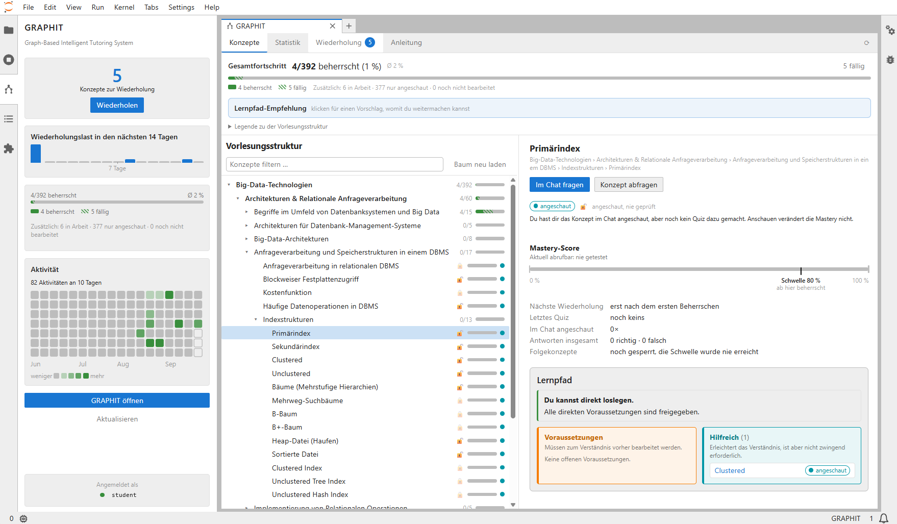
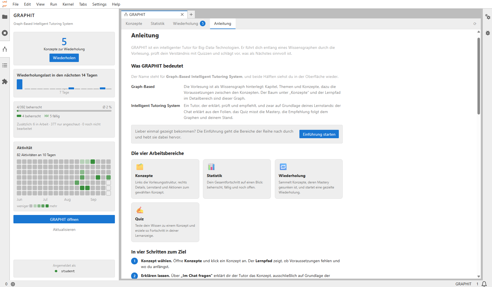
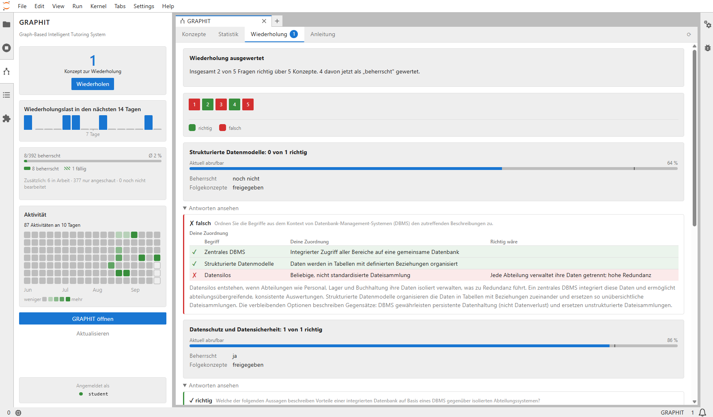
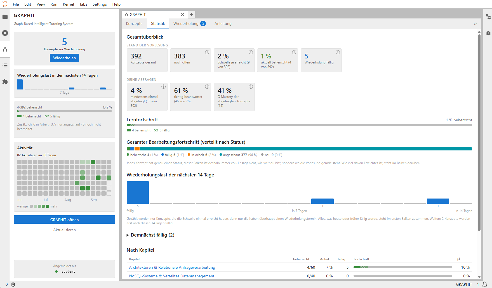
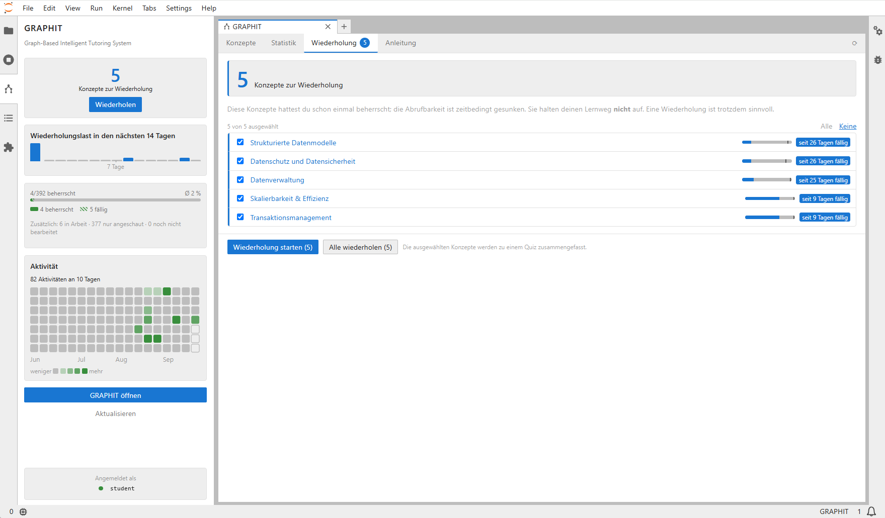
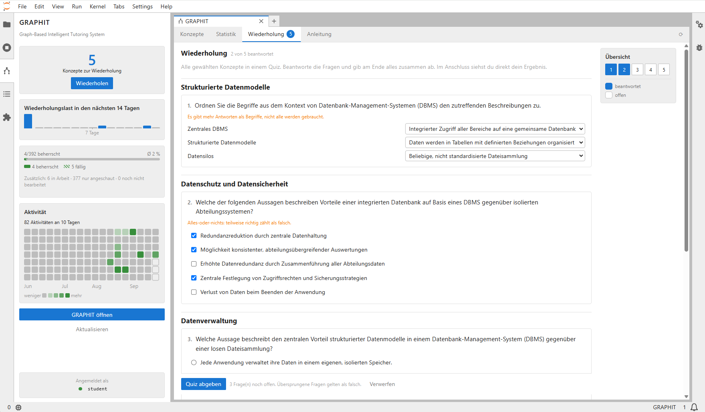

# GRAPHIT — JupyterLab Extension

**GRAPHIT** (*Graph-Based Intelligent Tutoring System*) is an intelligent tutoring system
for the university lecture *Big Data Technologies*. This repository contains its
**frontend**: a JupyterLab 4 extension that lets students explore the lecture as a
knowledge graph, chat with a tutor that answers strictly from the lecture slides, test
their understanding with quizzes and keep track of what is due for review — all without
leaving their notebooks.

> The user interface is in German, as it was built for a German-language lecture.



## Context

GRAPHIT was developed as part of a master's thesis. The overall system consists of two
parts:

- **Backend** (not part of this repository): a FastAPI service with a LangGraph
  multi-agent system (supervisor, tutor agent, recommender agent) and a quiz service on
  top of a Neo4j knowledge graph. The graph holds the **domain model** (lecture → chapter
  → topic → subtopic → concept, with prerequisite edges) and the **learner model** in the
  same database. Guiding principle: *the LLM phrases and routes, everything that is graded
  is deterministic code* — grading, mastery computation and prerequisite traversal do not
  involve a language model.
- **Frontend** (this repository): the JupyterLab extension described below. It talks to the
  backend directly via HTTP/CORS and has no server-side component of its own.

### Learner model in a nutshell

- **Mastery** is computed with Performance Factors Analysis (PFA) plus exponential
  forgetting (half-life 28 days). It decays over time, so a concept can drop from
  "mastered" to "due for review" without any action.
- **Peak mastery** never decays. Once it passes the threshold (0.8), the concept's gate is
  open for good and follow-on concepts stay unlocked — a decayed concept never blocks the
  learning path.
- **Visiting** a concept in the chat and **mastering** it in a quiz are separate signals.
  Chatting never changes mastery.

## Features

| Area | What it does |
|---|---|
| **Concepts** | Expandable lecture tree (chapters, topics, subtopics, concepts) with filter, keyboard navigation and progress badges; detail panel with mastery bar, peak marker, facts and the learning path (prerequisites, helpful concepts) of the selected concept |
| **Next steps** | Corpus-wide recommendation of concepts whose prerequisites are already met, in lecture order |
| **Chat** | Separate, dockable chat window bound to the selected concept; streamed answers (SSE) with collapsible slide citations; can be placed next to a notebook |
| **Quiz** | Five question types (single choice, multiple choice, cloze, matching, ordering incl. drag and drop), two-step submit, detailed feedback with solutions; a chapter or topic becomes one combined quiz |
| **Review** | All concepts whose mastery has decayed, selectable and answerable as one combined quiz with a question map |
| **Statistics** | Summary cards, status distribution, per-chapter progress and the review load of the next 14 days |
| **Sidebar** | At-a-glance dashboard: due reviews, review load, overall progress and a GitHub-style activity heatmap |
| **Guide & tour** | Built-in guide plus an interactive guided tour that highlights every area of the interface |
| **Demo mode** | Built-in mock backend with realistic data, latency and failure modes — no backend, database or LLM required |

### Screenshots

| Learning path | Manual / Chat |
|---|---|
|  |  |

| Quiz feedback | Statistics |
|---|---|
|  |  |

| Review | Review quiz |
|---|---|
|  |  |

## Installation

### Requirements

- Python ≥ 3.10 and **JupyterLab ≥ 4**
- **Node.js 20 LTS** (only for building from source)

### Install from source

```bash
git clone https://github.com/Barbarossa2711/GRAPHIT-Frontend.git
cd GRAPHIT-Frontend
python -m venv .venv
source .venv/bin/activate            # Windows: .\.venv\Scripts\Activate.ps1

pip install "jupyterlab>=4" hatchling hatch-jupyter-builder hatch-nodejs-version
jlpm install
jlpm build
pip install -e .
jupyter labextension develop . --overwrite
jupyter labextension list            # expected: graphit-jupyter v0.1.0 enabled OK
jupyter lab
```

On Windows, `jupyter labextension develop` creates a symlink and therefore requires
*Developer Mode* (Settings → System → For developers).

### Build a wheel

```bash
pip install build
python -m build                      # dist/graphit_jupyter-<version>-py3-none-any.whl
pip install dist/graphit_jupyter-*.whl
```

The wheel contains the prebuilt extension, so the target environment needs no Node.js.

### Try it without a backend (demo mode)

Create the user settings file
`~/.jupyter/lab/user-settings/graphit-jupyter/core.jupyterlab-settings`:

```json
{
  "mockMode": true,
  "studentId": "demo"
}
```

Start `jupyter lab`, then open **GRAPHIT** from the launcher or the sidebar icon.

### Development

```bash
jlpm watch        # terminal 1: rebuild on change
jupyter lab       # terminal 2; reload the browser after each rebuild
```

```bash
jlpm test         # unit tests (Vitest)
jlpm lint         # ESLint (React Hooks rules)
```

## Configuration

Settings live in `schema/core.json` (plugin id `graphit-jupyter:core`). They are hidden
from the Settings Editor because students do not need them; set them via user settings or
an `overrides.json`.

| Setting | Meaning |
|---|---|
| `baseUrl` | Backend URL, default `http://127.0.0.1:8077` |
| `studentId` | Sent as `X-Student-Id`; must stay stable across sessions. Under JupyterHub the hub user name is used automatically |
| `mockMode` | Demo mode with built-in sample data |
| `streaming` | Stream chat answers via Server-Sent Events |
| `reviewSessionSize` | Number of due concepts preselected in the review tab (default 5) |
| `persistChatHistory` | Keep an open chat across page reloads (default off) |
| `showDiagnostics` | Show the backend address and a connection test in the sidebar |
| `timeouts.*` | Per-endpoint timeouts (quiz generation: 240 s) |
| `mock.*` | Simulated latencies and failure rate in demo mode |

### Deployment on JupyterHub

The extension is a pure prebuilt labextension, so installing the wheel into the
single-user image is enough. Point it at the backend image-wide with
`${PREFIX}/share/jupyter/lab/settings/overrides.json`:

```json
{
  "graphit-jupyter:core": {
    "baseUrl": "https://graphit-backend.example.org"
  }
}
```

The backend must be reachable **from the browser** and must allow CORS for the hub
origin, including the `X-Student-Id` header. The authenticated hub user name is used as
student id; an explicit `studentId` setting takes precedence.

## Backend API

The extension expects the following endpoints:

| Endpoint | Purpose |
|---|---|
| `GET /v1/models` | Connection test |
| `GET /domain/tree` | Lecture hierarchy |
| `GET /progress` | Learner model per concept plus rollups |
| `GET /recommend?concept_id=…` | Learning path towards a concept |
| `GET /next` | Corpus-wide next steps |
| `GET /activity` | Daily activity for the heatmap |
| `POST /v1/chat/completions` | OpenAI-compatible chat (optionally streamed), with `scope`, `session_id` and `graphit_slides` extensions |
| `POST /quiz/candidates`, `/quiz/start`, `/quiz/submit` | Quiz generation and grading (`quiz_id` is single-use) |

The exact wire types are in [`src/api/types.ts`](src/api/types.ts).

## Project structure

```
src/
  index.ts              exports the three plugins
  plugins/core.ts       settings, student identity, store and client
  plugins/main.ts       sidebar, main widget, all commands
  plugins/chat.ts       chat widget (split-right)
  state/                shared store (Lumino signal), selectors, persistence
  api/                  wire types, HTTP client, SSE parser, error mapping, mock backend
  quiz/                 answer model, cloze parser
  tour/                 guided tour content and placement logic
  components/           React UI
  test/                 unit tests
style/                  CSS (JupyterLab theme variables only, light and dark)
schema/core.json        settings schema
```

The shared state lives in a store class with a Lumino signal instead of a React context:
the main view and the chat are separate React roots, and commands are the interface
between them.

## License

MIT, see [LICENSE](LICENSE).
